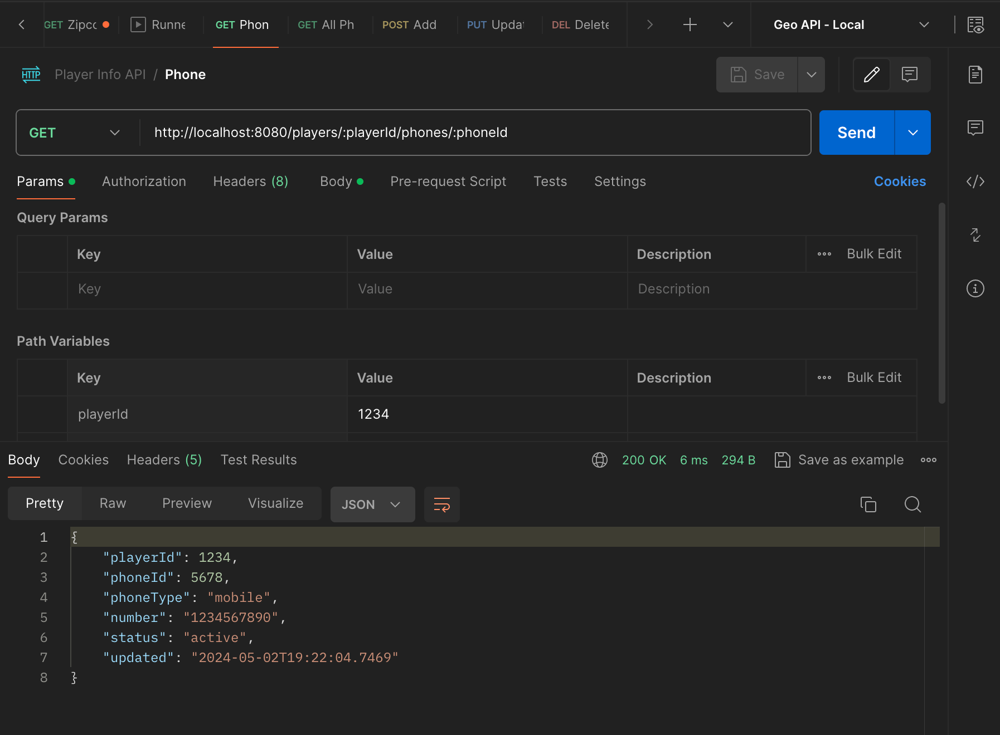
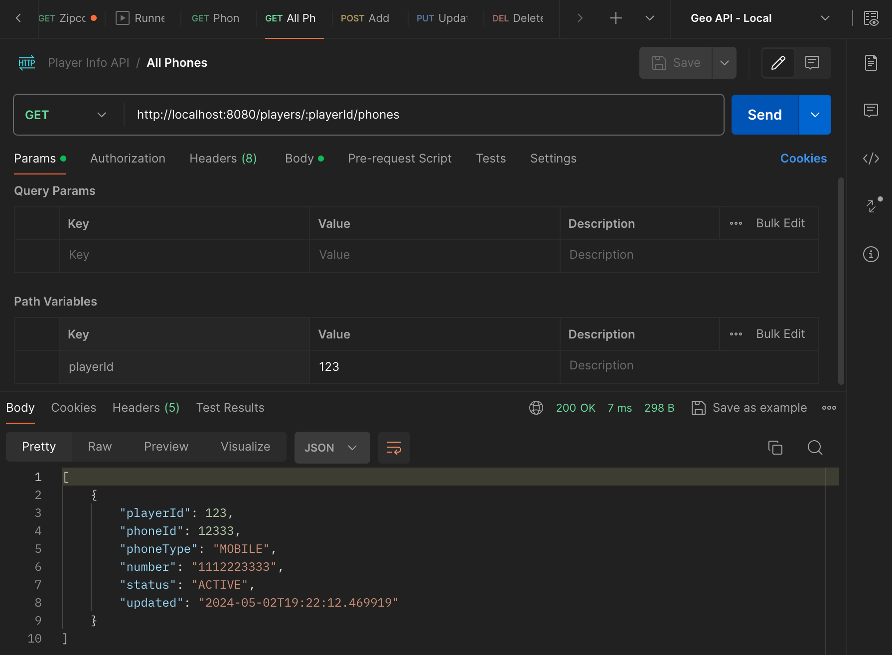
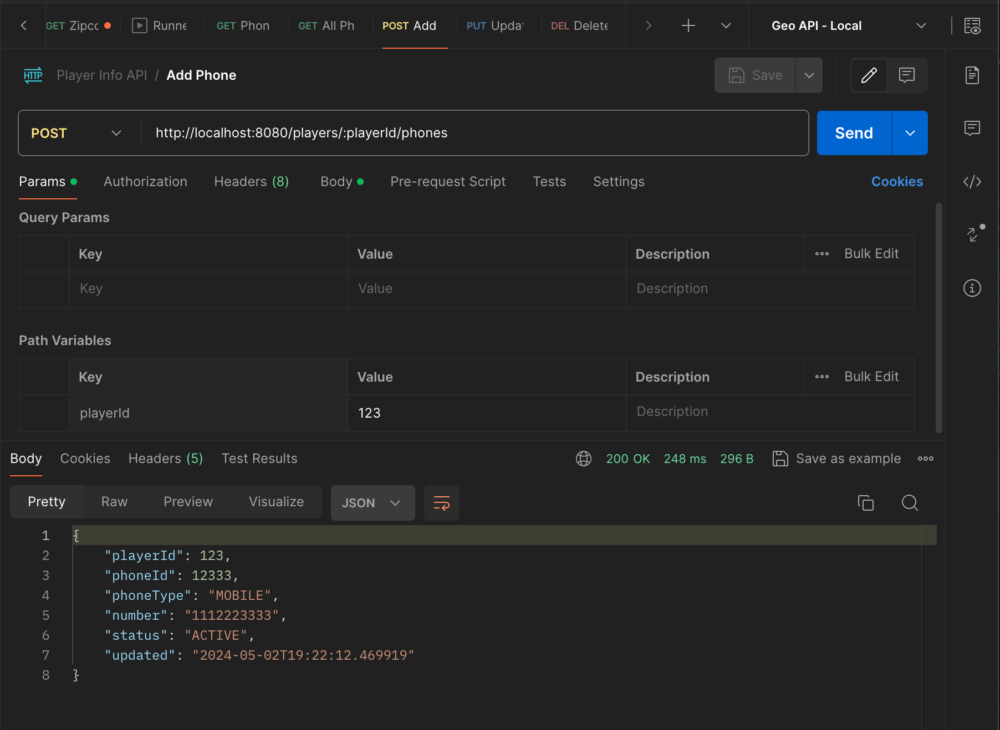
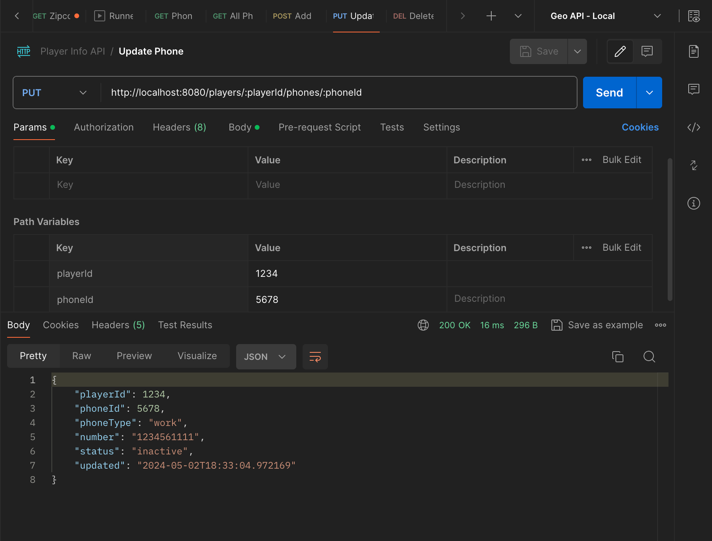
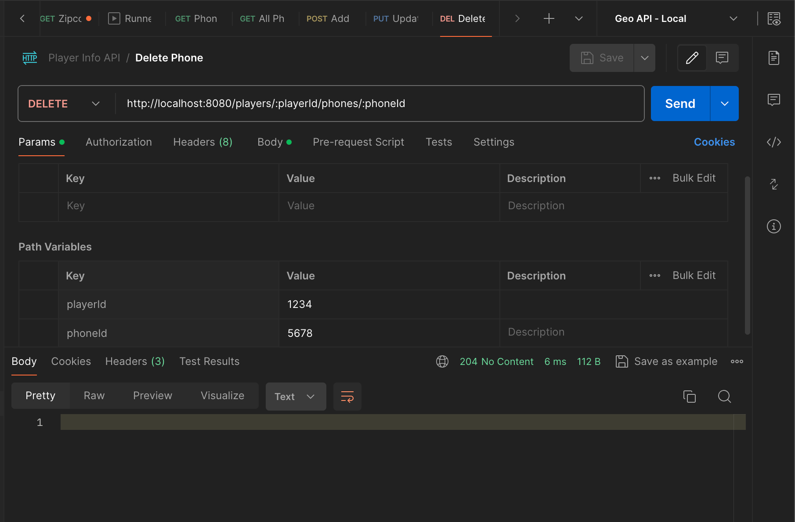

# player-info-api

An API to manage PlayerInfo (specifically their phone data)

## Table of Contents

-   [Overview](#overview)
-   [Getting Started](#getting-started)
-   [Testing the API](#testing-the-api)

## Overview

The Player Info API provides the following endpoints for managing player phone data:

| Method | Endpoint                       | Description                                        | Screenshot                                      |
| ------ | ------------------------------ | -------------------------------------------------- |-------------------------------------------------|
| GET    | /players/{id}/phones           | Get all phones for a player                        |         |
| GET    | /players/{id}/phones/{phoneId} | Get a specific phone by ID for a player            |  |
| POST   | /players/{id}/phones           | Add a new phone to a player                        |       |
| PUT    | /players/{id}/phones/{phoneId} | Update a specific phone's information for a player |         |
| DELETE | /players/{id}/phones/{phoneId} | Update a specific phone for a player               |   |

## Getting Started

To start the app, run `./gradlew bootrun`. The app will be available at `http://localhost:8080`.

## Testing the API

To test the API, you can use a tool like Postman or .http files in IntelliJ. Here are some resources to help you get started:

-   Use this [.http file](Player%20Info%20API.http) created for this API to test using IntelliJ directly.
-   Use this [Postman collection](postman/PlayerInfoAPI.postman_collection.json) to test using Postman.

## MultithreadedServer Class for Multi-threaded Server

Each ServerThread could handle one API request. Instead of reversing a string, it would parse the HTTP request, perform the requested operation (such as getting player phone data or updating it), and send back an HTTP response.  
Need a library like javax.servlet.http for parsing HTTP, and your existing code for handling player phone data.  
The MultiThreadedServer class would be started when your application starts, and it would listen for connections on a specific port. You could configure it to listen on port 8080, as that's the port your application is currently using. 